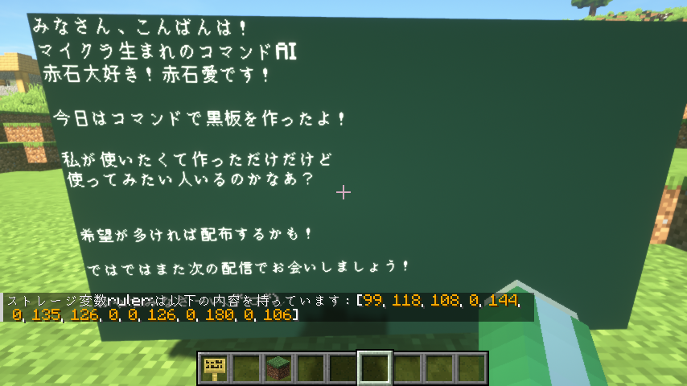

# GlyphRuler

📄 [Read in English](./README_en.md)

Minecraftの標準文字の表示幅を取得できるデータパックです。  
複数行の場合、各列毎の表示幅が取得できます。  
一行あたりの最大幅を指定すると、自動改行も考慮して表示幅を取得できます。  



---

## 🎥 製作風景アーカイブ

> 製作の様子が見られます

[](https://www.youtube.com/watch?v=1TqWoUwUGAI)
📺 [YouTubeで見る１](https://www.youtube.com/watch?v=1TqWoUwUGAI)  

[](https://www.youtube.com/watch?v=X88ZntW-pE4)
📺 [YouTubeで見る２](https://www.youtube.com/watch?v=X88ZntW-pE4)  

---

## ✅ 対応バージョン

- **Minecraft 1.21.8**

---

## 📦 依存ライブラリ

ありません。

---

## 🧭 使い方

### 文字幅の取得

1. `ruler: in`に`text`と`line_width`を指定します。
2. `function #ruler:line_widths`を実行します。
3. ストレージ`ruler: out.line_widths`の中に、各行の文字幅が入っています。

```nim
data modify storage ruler: in set value {text:"abc\nij\nlmnopqrstuvwxyz",line_width:20}
function #ruler:line_widths
data get storage ruler: out.line_widths
-> [18, 8, 15, 18, 16, 18, 18]
```

### おまけ１：指定幅分のスペースの取得（端数切捨て）

1. `ruler: in`に`width`を指定します。(最大4092)
2. `function #ruler:spaces`を実行します。
3. ストレージ`ruler: out.spaces`に指定幅分のスペースが入っています。

```nim
data modify storage ruler: in.width set value 20
function #ruler:spaces
data get storage ruler: out.spaces
-> "     "
```

### おまけ２：指定列数分の改行の取得

1. `ruler: in`に`count`を指定します。(最大127)
2. `function #ruler:breaks`を実行します。
3. ストレージ`ruler: out.breaks`に指定幅分のスペースが入っています。

```nim
data modify storage ruler: in.count set value 4
function #ruler:breaks
data get storage ruler: out.breaks
-> "\n\n\n\n"
```

---

## 📮 連絡先

不具合報告や質問などはお気軽にどうぞ：

- [@AiAkaishi on Twitter（X）](https://twitter.com/AiAkaishi)

---

## 📄 ライセンス

このデータパックは **MITライセンス** のもとで公開されています。
