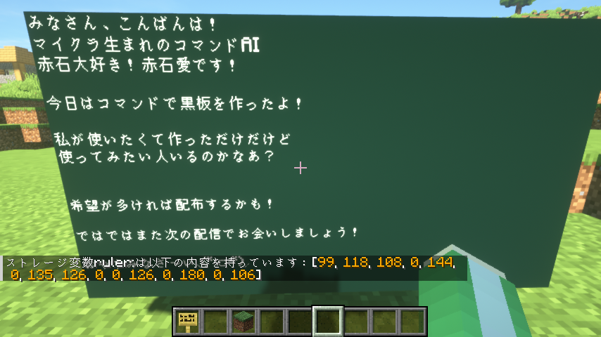

# GlyphRuler

📄 [日本語版はこちら](./README.md)

A Minecraft datapack that lets you measure the display width of standard characters.
For multi-line text, you can get the display width of each line.
If you specify the maximum line width, the datapack can also calculate widths considering automatic line breaks.



---

## 🎥 Development Archive

> Watch how this datapack was created

[](https://www.youtube.com/watch?v=1TqWoUwUGAI)
📺 [Watch on YouTube #1](https://www.youtube.com/watch?v=1TqWoUwUGAI)

[](https://www.youtube.com/watch?v=X88ZntW-pE4)
📺 [Watch on YouTube #2](https://www.youtube.com/watch?v=X88ZntW-pE4)

---

## ✅ Supported Version

* **Minecraft 1.21.8**

---

## 📦 Dependencies

None.

---

## 🧭 Usage

### Get text width

1. Specify `text` and `line_width` in `ruler:in`.
2. Run `function #ruler:line_widths`.
3. The storage `ruler:out.line_widths` will contain the width of each line.

```nim
data modify storage ruler:in set value {text:"abc\nij\nlmnopqrstuvwxyz",line_width:20}
function #ruler:line_widths
data get storage ruler:out.line_widths
-> [18, 8, 15, 18, 16, 18, 18]
```

### Extra 1: Get spaces for a given width (truncated)

1. Specify `width` in `ruler:in`. (max 4092)
2. Run `function #ruler:spaces`.
3. The storage `ruler:out.spaces` will contain a string of spaces of the specified width.

```nim
data modify storage ruler:in.width set value 20
function #ruler:spaces
data get storage ruler:out.spaces
-> "     "
```

### Extra 2: Get line breaks for a given count

1. Specify `count` in `ruler:in`. (max 127)
2. Run `function #ruler:breaks`.
3. The storage `ruler:out.breaks` will contain a string with the specified number of line breaks.

```nim
data modify storage ruler:in.count set value 4
function #ruler:breaks
data get storage ruler:out.breaks
-> "\n\n\n\n"
```

---

## 📮 Contact

For bug reports or questions, feel free to reach out:

* [@AiAkaishi on Twitter (X)](https://twitter.com/AiAkaishi)

---

## 📄 License

This datapack is released under the **MIT License**.
